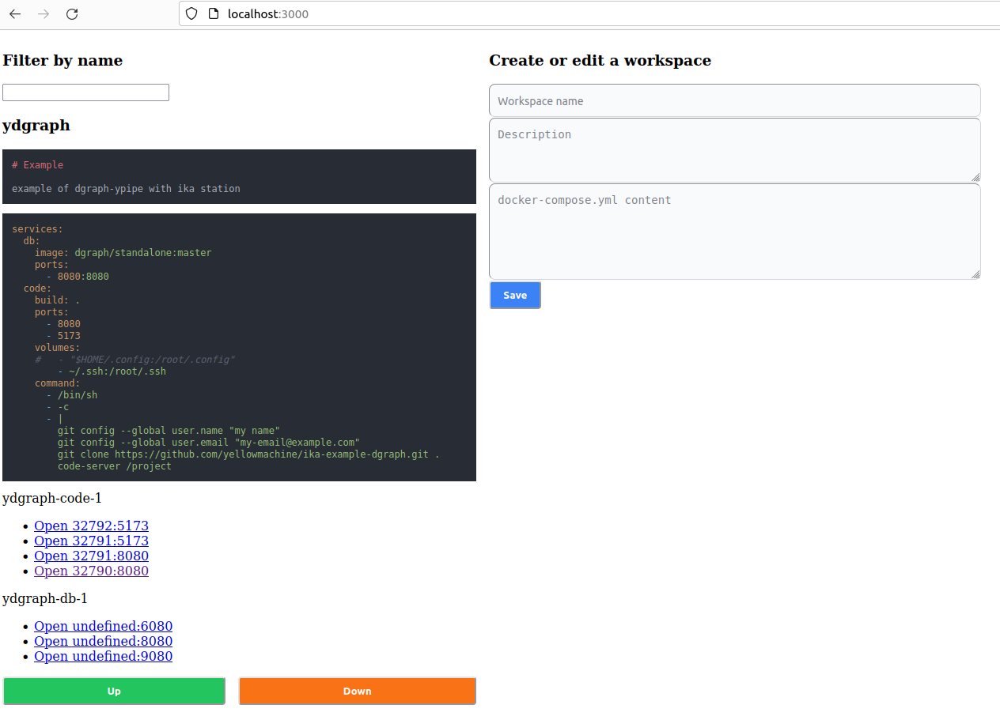

# code-workspaces

```bash
cd app
docker-compose up --build
```

then open http://localhost:3000  (password for code-server containers is the word "secret". You will change it later)



Files:

`docker-compose.yml`

```yml
services:
  ika:
    build: .
    ports:
      - 3000:3000
    volumes:
      - /var/run/docker.sock:/var/run/docker.sock
      - $PWD/../server/workspaces:/workspaces
```

`Dockerfile`

```Dockerfile
FROM node:16-alpine

RUN apk add docker docker-cli-compose

RUN npm install -g pnpm
WORKDIR /app

COPY package.json pnpm-lock.yaml ./
RUN pnpm install --frozen-lockfile
COPY . .

RUN pnpm build
EXPOSE 3000

ENV ORIGIN=http://localhost:3000
CMD ["node", "build"]
```

## Workspace example:

`docker-compose.yaml`

```yaml
services:
  db:
    image: dgraph/standalone:master
    ports:
      - 8080:8080
  code: 
    build: .
    ports: 
      - 8080
      - 5173
    command:
      - /bin/sh
      - -c
      - |
        git clone https://github.com/yellowmachine/ika-example-dgraph.git .
        code-server /project
```

`Dockerfile`

```Dockerfile
FROM node:16-bullseye

RUN apt-get update 
RUN apt-get install -y \
  build-essential \
  pkg-config \
  python3

RUN curl -fsSL https://code-server.dev/install.sh | sh

COPY config.yaml /root/.config/code-server/
WORKDIR /project

CMD code-server
```

`config.yaml`

```yaml
bind-addr: 0.0.0.0:8080
auth: password
password: secret
cert: false
```

[See example](./server/README.md)